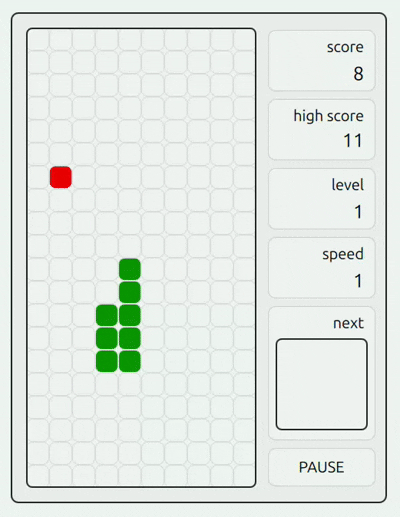
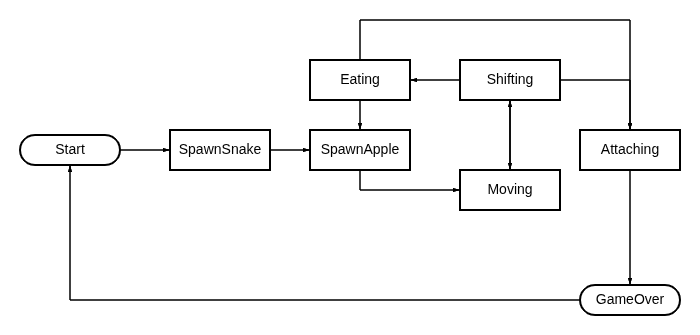
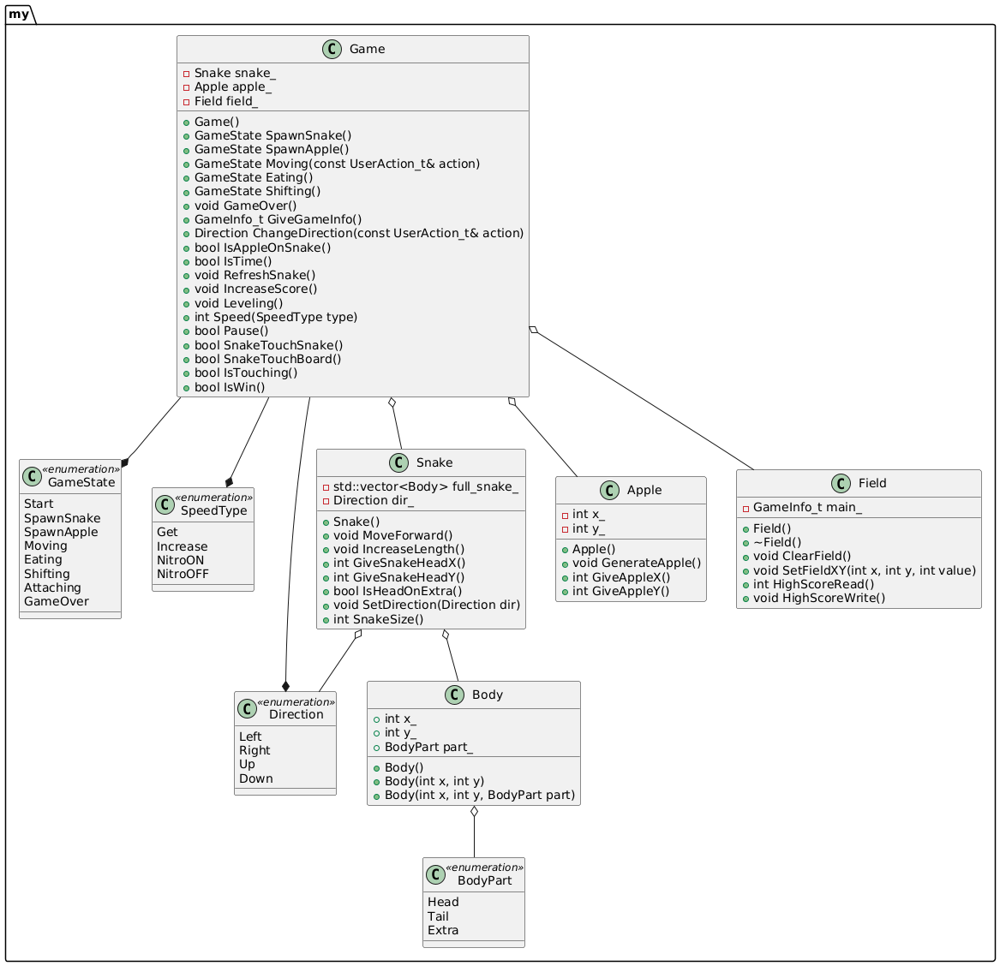
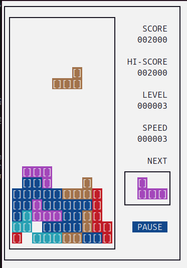
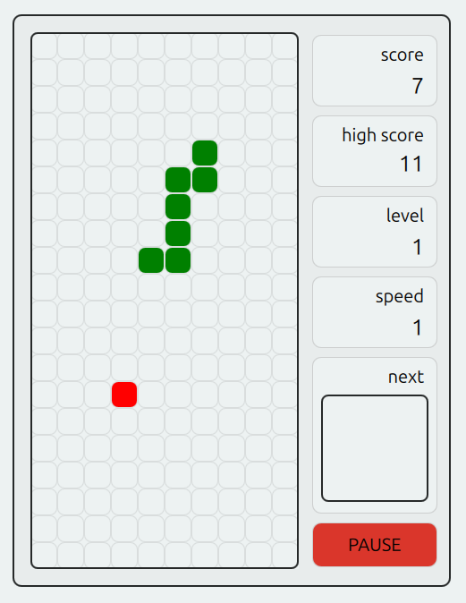
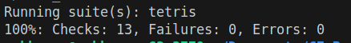
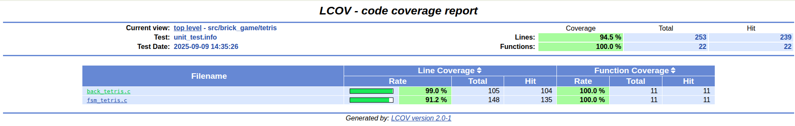
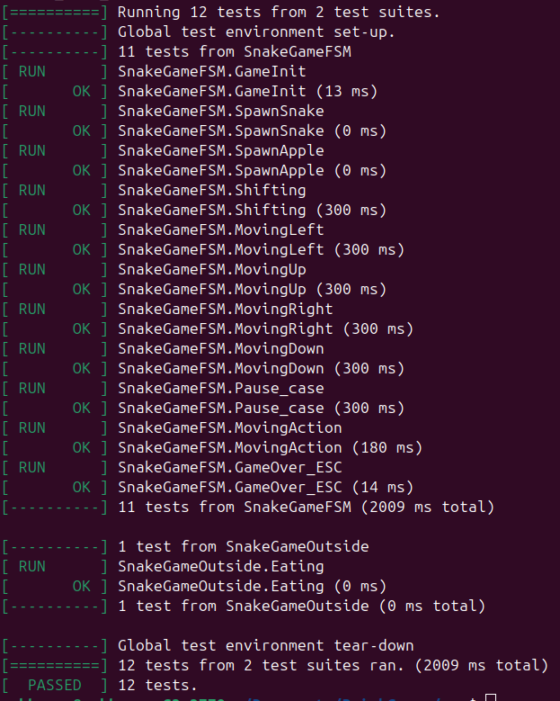
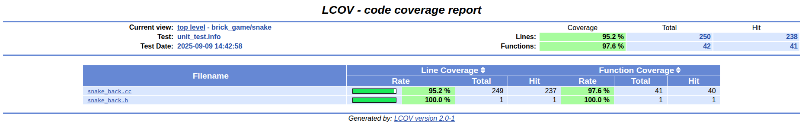

# BrickGames
## Описание

Реализация классических игр Тетрис и Змейка с консольным и десктопным интерфейсами.

## Реализация

### Пример работы




### Бэкенд 

Бизнес-логика игры Тетрис (бэкенд) написана на языке С, сконструирована по модели Конечного Автомата (КА, FSM, Finite-State Machine). Код писался с соблюдением принципов структурного программирования Дейкстры.


Логика игры Змейки написана на языке С++, так же сконструирована по модели Конечного Автомата. Код писался с соблюдением принципов структурного и в парадигме Объектно-ориентированного программирования.





### Фронтенд

Для игр реализованы два граффических интерфейса. Обе игры совместимы с обоими интерфейсами.

CLI — консольный интерфейс c использованием символьной псевдографики написан на С и использует библиотеку ncurses.h.



Десктопный интерфейс написан на С++ и фреймворке QT, а именное QT.Quick версии 6.9. Используется язык qml для отрисовки, и система сигналов и слотов на таймере для взаимодействия бэка и фронта.



### MVC

Проект построен на паттерне Model-View-Controller, то есть отделении логики представления (view), то есть отображения, и модели (model), то есть бизнес-логики, и соединения их с помощью тонкого контроллера.

### Сборка

Для удобства взаимодествия: полной сборки проекта, запуска тестов, проведения прочих проверок -- существует Makefile. Через него же собираются консольные версии игр. Для сборки десктопных версий используется CMake (с целями в том же Make'е).

Для сборки всех версий игр можно применить единую команду:
```
make install
```

## Тестирование

Код библиотеки покрыт тестами с помощью библиотеки GTest для С++ и check.h для С, покрытие тестами составляет более 95%, что можно проверить спомощью GCOV.

### Тесты тетриса




### Тесты змейки




На утечки памяти код тестировался с помощью утилит fsanitaze для gcc и valgrind.

## Стиль

Проект написан на С++17 и С11 и разрабатывался в соответсвии с Google Style. Для проверки и форматирования кода использовалась утилита clang-format 18.1.8 и cppcheck.

